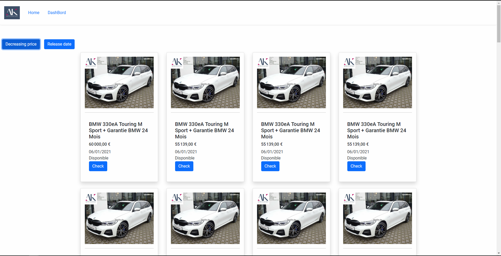

# CarsTP
## List task

- [x] Créer un projet Angular 
- Effectuer un CRUD sur toutes vos voitures :
-- [x] Afficher les voitures (Quelques informations seulement)
-- [x] Permettre l'ajout avec un formulaire
-- [x] l'edition
-- [x] suppression
-- [x] Permettre l'affichage d'une voiture avec tous leurs détails (Composant à part)
- Mettre en place un filtre : 
-- [x] Annonce la plus récente à la plus ancienne
-- [x] Annonce la plus ancienne à la plus récente
-- [x] Prix croissants
-- [x] Prix décroissants
- [ ] Mettre en place une recherche par mot
- [ ] Mettre en place un prix minimum et un prix maximum pour la recherche
- [x] Utiliser un cadriciel (Boostrap,  Material Angular, Tailwind...etc)
- Bonus
- [ ] afficher une carte avec l'adresse de la voiture
- [ ] Authentification Spring Boot security

## pictures
 
### Home Page
 

### Car Detail Page

### Dashbord Page

### Edit page

 
### Add page
 
